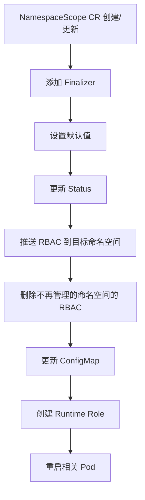

# IBM Namespace Scope Operator 工作原理详解

## 概述

IBM Namespace Scope Operator (NSS Operator) 是一个 Kubernetes Operator，用于自动化管理跨命名空间的操作符权限和监控范围。它解决了在 OpenShift 集群中，让一个命名空间中的 Operator 能够管理其他命名空间资源的问题。

## 核心概念

### 1. 问题背景

在 Kubernetes/OpenShift 环境中：
- Operator 通常只能监控和管理自己所在命名空间的资源
- 使用 OLM (Operator Lifecycle Manager) 的 `OperatorGroup` 可以扩展范围，但管理复杂
- 需要手动配置 RBAC 权限和 ServiceAccount 绑定

### 2. NSS Operator 的解决方案

NSS Operator 提供了一种声明式的方式来：
- 扩展 Operator 的监控命名空间列表（`WATCH_NAMESPACE`）
- 自动创建跨命名空间的 RBAC 权限
- 自动重启相关 Pod 以应用新配置
- 可选地自动注入 CSV (ClusterServiceVersion) 配置

## 架构组件

### 1. 自定义资源 (CR)

**NamespaceScope CR** 定义了以下关键字段：

```go
type NamespaceScopeSpec struct {
    // 要管理的目标命名空间列表
    NamespaceMembers []string
    
    // 额外的 ServiceAccount 成员
    ServiceAccountMembers []string
    
    // 存储命名空间列表的 ConfigMap 名称
    ConfigmapName string
    
    // 当命名空间列表变化时需要重启的 Pod 标签
    RestartLabels map[string]string
    
    // 是否手动管理权限
    ManualManagement bool
    
    // CSV 注入器配置
    CSVInjector CSVInjector
}
```

### 2. 控制器架构

NSS Operator 运行两个主要的 Reconcile 循环：

#### A. 主 Reconcile 循环 (`Reconcile`)
监控 `NamespaceScope` CR 和 `ConfigMap` 的变化

#### B. CSV Reconcile 循环 (`CSVReconcile`)
监控 `ClusterServiceVersion`、`ValidatingWebhookConfiguration` 和 `MutatingWebhookConfiguration` 的变化

## 工作流程详解

### 阶段 1: CR 创建/更新时的处理



#### 1.1 初始化和验证

```go
// 主 Reconcile 函数入口
func (r *NamespaceScopeReconciler) Reconcile(ctx context.Context, req ctrl.Request) (ctrl.Result, error) {
    // 1. 获取 NamespaceScope 实例
    instance := &operatorv1.NamespaceScope{}
    
    // 2. 检查是否正在删除
    if !instance.GetDeletionTimestamp().IsZero() {
        // 清理 ConfigMap 和 RBAC
        // 移除 Finalizer
    }
    
    // 3. 添加 Finalizer（如果不存在）
    // 4. 设置默认值
    // 5. 更新状态
}
```

#### 1.2 RBAC 权限推送 (`PushRbacToNamespace`)

这是核心功能之一，为每个目标命名空间创建必要的权限：

```go
func (r *NamespaceScopeReconciler) PushRbacToNamespace(ctx context.Context, instance *operatorv1.NamespaceScope) error {
    // 1. 获取源命名空间的所有 ServiceAccount
    saNames := r.GetServiceAccountFromNamespace(ctx, instance, fromNs)
    
    // 2. 并发为每个目标命名空间生成 RBAC
    for _, toNs := range instance.Status.ValidatedMembers {
        go func(toNs string) {
            r.generateRBACToNamespace(ctx, instance, saNames, fromNs, toNs)
        }(toNs)
    }
}
```

**生成的 RBAC 资源包括：**

1. **Role**: 在目标命名空间中创建
   - 名称格式: `nss-managed-role-from-{源命名空间}`
   - 权限: 对所有资源的完全访问权限

2. **RoleBinding**: 绑定 Role 到源命名空间的 ServiceAccount
   - 允许源命名空间的 ServiceAccount 访问目标命名空间

3. **Runtime Role**: 基于目标命名空间现有 Role 的聚合权限
   - 名称格式: `nss-runtime-role-from-{源命名空间}`
   - 动态收集目标命名空间中的所有权限规则

#### 1.3 ConfigMap 管理 (`UpdateConfigMap`)

```go
func (r *NamespaceScopeReconciler) UpdateConfigMap(ctx context.Context, instance *operatorv1.NamespaceScope) error {
    // 1. 获取或创建 ConfigMap
    cm := &corev1.ConfigMap{
        Data: map[string]string{
            "namespaces": "ns1,ns2,ns3"  // 逗号分隔的命名空间列表
        }
    }
    
    // 2. 如果命名空间列表发生变化
    if util.CheckListDifference(validatedMembers, existingMembers) {
        // 更新 ConfigMap
        // 触发 Pod 重启
        r.RestartPods(ctx, instance.Spec.RestartLabels, cm, instance.Namespace)
    }
}
```

**ConfigMap 结构：**
```yaml
apiVersion: v1
kind: ConfigMap
metadata:
  name: namespace-scope
  namespace: ibm-common-services
data:
  namespaces: "ibm-common-services,cp4i,default"
```

#### 1.4 Pod 重启机制 (`RestartPods`)

当命名空间列表变化时，需要重启相关的 Operator Pod：

```go
func (r *NamespaceScopeReconciler) RestartPods(ctx context.Context, labels map[string]string, cm *corev1.ConfigMap, namespace string) error {
    // 1. 查找匹配标签的 Pod
    podList := r.Client.List(ctx, podList, client.MatchingLabels(labels))
    
    // 2. 根据 Pod 的 OwnerReference 类型处理
    for _, pod := range podList.Items {
        switch ownerKind {
        case "ReplicaSet":
            // 更新 Deployment 的 Pod Template 注解
            deploy.Spec.Template.Annotations["nss.ibm.com/namespaceList"] = hash
        case "DaemonSet":
            // 更新 DaemonSet 的 Pod Template 注解
        case "StatefulSet":
            // 更新 StatefulSet 的 Pod Template 注解
        }
    }
    
    // 3. 对于 OLM 管理的 Pod，直接删除
    if pod.Annotations["olm.operatorGroup"] exists {
        r.Client.Delete(ctx, &pod)
    }
}
```

**重启策略：**
- **Deployment/DaemonSet/StatefulSet**: 通过更新 Pod Template 注解触发滚动更新
- **OLM Operator Pod**: 直接删除，由 OLM 重新创建

### 阶段 2: CSV 注入（可选功能）

当 `CSVInjector.Enable = true` 时，NSS Operator 会自动修改 ClusterServiceVersion：

```go
func (r *NamespaceScopeReconciler) CSVReconcile(ctx context.Context, req ctrl.Request) (ctrl.Result, error) {
    // 1. 查找带有注解的 CSV
    // 注解: nss.operator.ibm.com/managed-operators: "operator1,operator2"
    
    // 2. 为每个 CSV 注入配置
    for _, csv := range csvList.Items {
        // 2.1 注入 RestartLabels 到 Pod Template
        podTemplate.Labels[k] = v
        
        // 2.2 注入 WATCH_NAMESPACE 环境变量
        configmapEnv := corev1.EnvVar{
            Name: "WATCH_NAMESPACE",
            ValueFrom: &corev1.EnvVarSource{
                ConfigMapKeyRef: &corev1.ConfigMapKeySelector{
                    Key: "namespaces",
                    LocalObjectReference: corev1.LocalObjectReference{
                        Name: configmapName,
                    },
                },
            },
        }
        
        // 2.3 可选：修补 Webhook 配置
        if csv.Annotations["nss.operator.ibm.com/patch-webhook"] exists {
            r.patchWebhook(ctx, instance, &csv, validatedMembers)
        }
    }
}
```

**CSV 注入的内容：**

1. **环境变量注入**：
```yaml
env:
  - name: WATCH_NAMESPACE
    valueFrom:
      configMapKeyRef:
        name: namespace-scope
        key: namespaces
```

2. **Pod 标签注入**：
```yaml
template:
  metadata:
    labels:
      intent: projected  # 或其他 RestartLabels
```

3. **Webhook 配置修补**（如果启用）：
   - 更新 `namespaceSelector` 以包含所有管理的命名空间
   - 同时处理 MutatingWebhookConfiguration 和 ValidatingWebhookConfiguration

### 阶段 3: 清理和删除

当 NamespaceScope CR 被删除时：

```go
// Finalizer 处理
if !instance.GetDeletionTimestamp().IsZero() {
    // 1. 更新 ConfigMap（移除命名空间）
    r.UpdateConfigMap(ctx, instance)
    
    // 2. 删除所有创建的 RBAC 资源
    r.DeleteAllRbac(ctx, instance)
    
    // 3. 移除 Finalizer
    controllerutil.RemoveFinalizer(instance, constant.NamespaceScopeFinalizer)
}
```

## 关键特性

### 1. 命名空间验证

在应用配置前，NSS Operator 会验证目标命名空间：

```go
func (r *NamespaceScopeReconciler) getValidatedNamespaces(ctx context.Context, instance *operatorv1.NamespaceScope) ([]string, error) {
    // 1. 检查命名空间是否存在
    // 2. 检查是否有权限访问（通过 SelfSubjectAccessReview）
    // 3. 返回验证通过的命名空间列表
}
```

### 2. 权限检查

```go
func (r *NamespaceScopeReconciler) checkGetNSAuth(ctx context.Context) bool {
    // 使用 SelfSubjectAccessReview 检查是否有权限列出命名空间
    sar := &authorizationv1.SelfSubjectAccessReview{
        Spec: authorizationv1.SelfSubjectAccessReviewSpec{
            ResourceAttributes: &authorizationv1.ResourceAttributes{
                Verb:     "get",
                Resource: "namespaces",
            },
        },
    }
}
```

### 3. 手动管理模式

当 `ManualManagement: true` 时：
- NSS Operator 不会自动创建跨命名空间的权限
- 管理员需要使用 `authorize-namespace.sh` 脚本手动授权
- 适用于严格的安全环境

### 4. Runtime Role 聚合

NSS Operator 会收集目标命名空间中的所有 Role 权限，并创建一个聚合的 Runtime Role：

```go
func (r *NamespaceScopeReconciler) CreateRuntimeRoleToNamespace(ctx context.Context, instance *operatorv1.NamespaceScope, toNs string, summarizedRules []rbacv1.PolicyRule) error {
    // 1. 获取目标命名空间的所有 Role
    rolesList := r.GetRolesFromNamespace(ctx, instance, toNs)
    
    // 2. 聚合所有权限规则（排除 NSS 管理的 Role）
    for _, role := range rolesList {
        if !strings.HasPrefix(role.Name, "nss-") {
            summarizedRules = append(summarizedRules, role.Rules...)
        }
    }
    
    // 3. 创建 Runtime Role
    r.generateRuntimeRoleForNSS(ctx, instance, summarizedRules, fromNs, toNs)
}
```

## 监控和事件

### 1. Controller 设置

NSS Operator 设置了两个独立的控制器：

```go
func (r *NamespaceScopeReconciler) SetupWithManager(mgr ctrl.Manager) error {
    // 控制器 1: 主 NamespaceScope 控制器
    ctrl.NewControllerManagedBy(mgr).
        Named("NamespaceScope contorller").
        Owns(&corev1.ConfigMap{}).
        For(&operatorv1.NamespaceScope{}).
        Complete(reconcile.Func(r.Reconcile))
    
    // 控制器 2: CSV 注入控制器
    ctrl.NewControllerManagedBy(mgr).
        Named("NamespaceScope CSV contorller").
        For(&operatorv1.NamespaceScope{}).
        Watches(&olmv1alpha1.ClusterServiceVersion{}, ...).
        Watches(&admissionv1.ValidatingWebhookConfiguration{}, ...).
        Watches(&admissionv1.MutatingWebhookConfiguration{}, ...).
        Complete(reconcile.Func(r.CSVReconcile))
}
```

### 2. 监控的资源

- **NamespaceScope CR**: 主要配置资源
- **ConfigMap**: 命名空间列表存储
- **ClusterServiceVersion**: OLM Operator 定义
- **ValidatingWebhookConfiguration**: 验证 Webhook
- **MutatingWebhookConfiguration**: 变更 Webhook

### 3. Reconcile 频率

- 主 Reconcile: 每 60 秒重新调谐
- CSV Reconcile: 每 180 秒重新调谐

## 使用场景

### 场景 1: 多租户环境

```yaml
apiVersion: operator.ibm.com/v1
kind: NamespaceScope
metadata:
  name: common-service
  namespace: ibm-common-services
spec:
  namespaceMembers:
  - tenant1
  - tenant2
  - tenant3
  configmapName: namespace-scope
  restartLabels:
    intent: projected
```

**效果：**
- `ibm-common-services` 中的 Operator 可以管理 tenant1、tenant2、tenant3
- 自动创建必要的 RBAC 权限
- 当租户列表变化时自动重启 Operator

### 场景 2: 与 OLM 集成

```yaml
apiVersion: operator.ibm.com/v1
kind: NamespaceScope
metadata:
  name: common-service
  namespace: ibm-common-services
spec:
  namespaceMembers:
  - cp4i
  - cp4d
  configmapName: namespace-scope
  csvInjector:
    enable: true
```

**CSV 需要添加注解：**
```yaml
apiVersion: operators.coreos.com/v1alpha1
kind: ClusterServiceVersion
metadata:
  annotations:
    nss.operator.ibm.com/managed-operators: "my-operator,dependency-operator"
```

**效果：**
- 自动修改 CSV 的 WATCH_NAMESPACE 环境变量
- 自动添加 RestartLabels
- 可选地修补 Webhook 配置

## 安全考虑

### 1. 权限模型

NSS Operator 需要以下权限：
- 在自己的命名空间：完全权限
- 在目标命名空间：创建 Role 和 RoleBinding 的权限
- 集群级别：列出命名空间的权限（可选）

### 2. 最小权限原则

虽然 NSS 创建的 Role 默认有广泛权限，但可以通过以下方式限制：
- 使用 `ManualManagement: true` 手动控制权限
- 使用 Runtime Role 只授予目标命名空间已有的权限
- 定期审计创建的 RBAC 资源

### 3. 命名空间隔离

- NSS Operator 不会破坏命名空间隔离
- 只是授权特定的 ServiceAccount 访问其他命名空间
- 可以随时撤销权限（删除 NamespaceScope CR）

## 故障排查

### 常见问题

1. **Pod 没有重启**
   - 检查 Pod 是否有正确的 RestartLabels
   - 检查 ConfigMap 是否正确挂载

2. **权限不足**
   - 检查 NSS Operator 是否有创建 Role/RoleBinding 的权限
   - 使用 `authorize-namespace.sh` 脚本手动授权

3. **CSV 注入不生效**
   - 检查 CSV 是否有 `nss.operator.ibm.com/managed-operators` 注解
   - 检查 `csvInjector.enable` 是否为 true

### 日志和调试

NSS Operator 使用 klog 记录详细日志：
- Info 级别：正常操作
- Error 级别：错误和失败
- V(2) 级别：详细调试信息

## 总结

IBM Namespace Scope Operator 通过以下机制实现跨命名空间的 Operator 管理：

1. **声明式配置**: 通过 NamespaceScope CR 定义目标命名空间
2. **自动 RBAC 管理**: 自动创建和维护跨命名空间的权限
3. **ConfigMap 同步**: 维护命名空间列表供 Operator 使用
4. **智能 Pod 重启**: 当配置变化时自动重启相关 Pod
5. **OLM 集成**: 可选的 CSV 自动注入功能
6. **Webhook 支持**: 自动修补 Webhook 配置以支持多命名空间

这种设计使得在 Kubernetes/OpenShift 环境中管理多命名空间的 Operator 变得简单和可靠。
